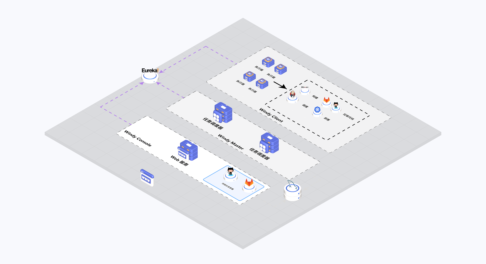

# **Windy**

Windy是一款轻量级Devops平台工具,支持服务代码变更管理，代码部署、用例编写、代码测试、流水线扩展等特性。使用Windy你可以在最简化的资源的情况下，保证业务功能的正确性以及延续性(多次迭代的情况下，依然可以保证历史业务不受影响)。简单来说，windy覆盖了日常开发的整个生命周期，从代码构建、部署、测试、发布、上线都支持。

## 已支持功能
- 服务管理：
   - 服务配置管理，以及支持对接不同git平台(Github、gitlab、gitea)
   - api管理：管理业务所有的api、支持api生成二方包(jar)、支持第三方文件导入(postman、yapi)
- 流水线管理：
   - 支持变更分支管理: 代码分支可关联需求与缺陷，支持代码分支级别溯源。
   - 流水线: 
     - 流水线默认集成了代码构建、人工审核、自动化用例、代码合并、代码部署等节点支撑研发质量功能。
     - 支持三种不同的流水线，根据实际情况使用: 自定义流水线(日常开发使用)，定时流水线(长运环境测试)、代码发布流水线(开发分支合入Master的功能)
   - 自定义流水线节点: 除了默认节点外，Windy流水线还支持通过HTTP的方式集成公司内部系统任务提高很大的扩展性，如果集成现有jenkins、触发内部的邮件服务等。
- 自动化用例管理：
    - 基于UI编排模版完成自动化测试，降低使用测试门槛和成本
    - 除常规Rest接口功能测试外，还可支持自定义插件完成中间件(mysql、redis、http、kafka等)数据校验
    - 支持服务级别用例以及e2e(端到端)的测试方式
    - 支持统一套测试用例覆盖不同的环境
- 需求缺陷管理：支持创建需求、缺陷以及迭代。
- 支持SSH和Kubernetes部署
- 研发工具插件开发：提供研发工具(Idea、Vscode)的插件，面向开发者更友好。

## 未来计划
- 支持api审核机制、支持api生成文档
- 生态集成:
    - 消息通知: 对接三方系统消息通知机制(企业微信、钉钉、飞书等)
    - 三方系统对接: 对接阐道、JIRA、PingCode等api，将三方系统数据同步至Windy中。
    - 代码检查、以及覆盖率校验等
- 指标体系：支持需求、缺陷、研发、测试全流程数字指标建设，完成研发体系可视化，能够查看需求从创建到实现完成的整个生命周期数据
- 战略规划：通过研发体系数据化能力，将组织战略拆分细化能全局查看战略落地情况
- AI建设:
    - 通过AI分析研发体系数据，提供优化研发效率手段、梳理研发流程阻塞点等
    - AI自动添加测试用例

## 整体设计
### 介绍
Windy在设计之初是为了实现开发过程中研发质量的保证以及研发过程一体化的可视、可度量的目标，所以Windy的功能模块都是根据需求的生命周期来设计的，从需求的创建、开发、测试、发布都可以在Windy一个工具平台无缝衔接使用。

Windy在架构上分为三个部分：Console、Master、Client。Console服务负责创建和整理所有任务的元数据，然后由Master节点负责调度任务以及分发给Client，Client来实现任务的执行。其中在Client的设计上提出了"零依赖"的想法，也就是说Client除了依赖jdk之外其他任何组件都不依赖，任意的一台linux服务器都可直接运行，这个设计大大提高了Client节点的适配性。并且在Windy的整体使用设计上，也是只依赖Mysql一个中间组件，也减少了整个工具使用的复杂度。

架构图如下：

在现有的设计模式下Console、Master、Client是基于注册中心Eureka来相互发现的，所以可以根据自己业务的体量动态调整模块的实例个数。并且在UI交互与后端任务执行解偶的场景下，调整的过程是不会影响到正在使用的业务。

### Windy-Console
Windy-Console就是页面的API服务完成所有模块数据的创建与维护，其实在Windy的使用过程中，用户大部分时间是在Console中完成。在Console中完成服务的创建、API的管理、流水线的创建、用例的维护、模版的创建、以及环境管理等功能。

### Windy-Master
Master节点主要负责所有任务功能的调度，由于Client的设计是不依赖任何中间件组件(也包括不依赖mysql)，所以任务的所有数据都要从Master节点组装完成之后CLient才可执行。
其中master节点除了接收来自console触发的任务之外，还会执行定时的任务，比如定时的流水线以及调度重建任务。

其中重建任务是指，在Master正常调度过程中服务突然崩溃导致任务丢失的场景，每当Master节点重新启动或者1小时间隔扫描都会检测是否存在重建任务，发现重建任务就会触发任务重新执行。

### Windy-Client

Client时windy的所有任务的实际执行者，其中处理任务所需要的数据都来自于master节点。Client支持的任务如下：
- 流水线执行
- 代码构建： 支持从git地址拉取代码然后构建代码产物，目前支持Java、Go语言。
- 代码部署：根据构建的产物，部署到对应的环境中，支持K8S部署以及远程SSH部署。
- 人工审批：，在开发分支需要发布到主分支时通过审批后才可执行，一般在发布流水线中使用
- 触发用例任务：在流水线构建分支代码之后，可以关联执行服务的测试用例保证代码质量。
- 代码合并：将开发分支合并到主分支中
- 用例任务执行：执行在测试集中编写的单个用例
- 任务执行： 执行负载任务管理中绑定的任务列表
- API二方包生成： 根据服务的API列表生成二方包，业务根据二方包来开发业务，当需要变更API时就需要重新生成二方包，进而可以长期维护API信息与代码的一致性。并且在后面的迭代中添加审核机制，可以更好的管理API的质量。
